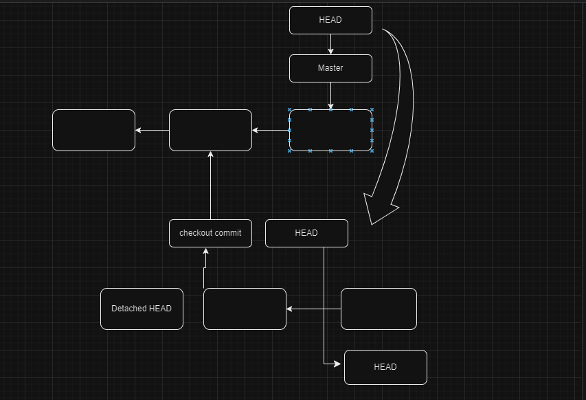
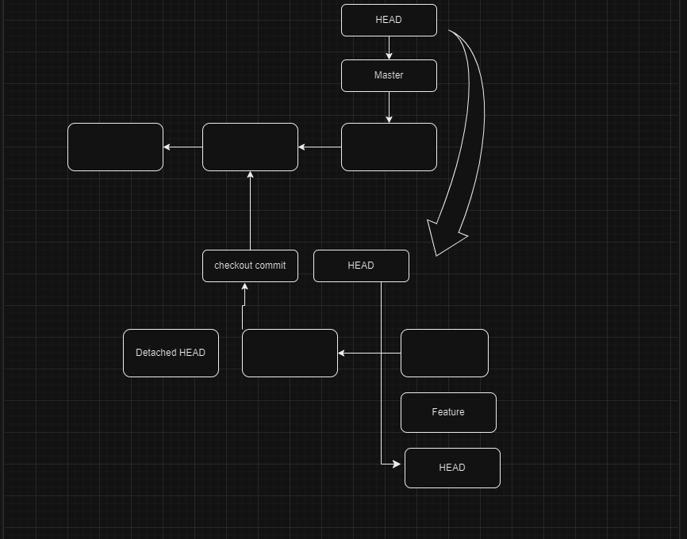

# <ins> Detached Head </ins> #

- git has pointer to the `currently checked in branch` and when we make nay commit then `branch pointer` will move to the `new commit` but the `HEAD` will pointing to the `currently checkout branch`

- when we checked out to a new branch then `HEAD` will point to that `checked out branch`

- if we checked into the `specific commit` by using the command as `git checkout <commit SHA code>` then it will move to the `detached HEAD` state where `HEAD` will not point to the `specific checkout branch` but rather refer to the ` point to the checkout commit SHA`

- in this particular state we can perform some `experimental commits` when we are on the `Detached HEAD` state and once we back the `HEAD` to the currently checkout branch those `experimental commit` will be garbage collected

- if we want to `retain` the `experimental commit` then in that case we need to `create new branch from Detached HEAD state`

- **Brief Explanation on Detached Head State**

    - when we checkout to any branch `HEAD` will point to the `checked out branch` by default 

    - when we make commit on the `currently checked out branch` the `branch pointer i.e master/main` moved to the `new commit`
    
    - `HEAD` also move along with the `branch pointer` to the `lastest commit SHA reference`

    - when we checkout to a specific commit by using the command as `git checkout <commit SHA>` then the `HEAD` move to the `specific commit` to which we been checked in which is known as `Deatched HEAD` state

    - `Detached HEAD` is a `position` where the `HEAD` not pointing to the `specific branch pointer` rather point to the `specific commit SHA that we checked into`

    - When we are in the `Detached HEAD state` then we can see the `content of the working DIR` on that stage 

    - we can also make the `experimental commit` when are in the `Detached HEAD` state

    - we can able to `experimnental commit` when `HEAD` points to the `specific checked out commits`
    
    - when we make the `experimental commits` then `HEAD` point to the `experimental commit` which is not a part of the `branch commit`

    - when we again checkout to the `branch` using the command `git checkout master` then `HEAD` will point to the `branch pointer` a it is no more in `Detached HEAD` state then those `experimental commit` will be `garbage collected` as neither `HEAD` or any other branch point to it
    
    -  

    - but if we want to retain the `experimental commits` then we can create a `new bnranch` as the `new branch created` then `HEAD` will point to the `new branch` and we are no longer in `Detached HEAD` mode and `as there is a branch pointing to it` hence those commit will not be `garbage collected`

    - 

**Detached Head State in Action**

  - we can see the `HEAD` location by using the command as `cat .git/HEAD` hwere it will say the `ref` as the `HEAD` refer to any `branch or commit`
  
  - as by default the `HEAD` points to the `branch` as we see it in the `.git/HEAD` refernce  if any new commit been made then `branch pointer` will move along with that `HEAD` is also going to get moved
  
  - we can checkout to the commit `giot checout <commit SHA shorter>` when we checked in to a specific commit then it will show the message as `git enter to the detached HEAD state` and we can make `experimental commit` and `discard` then when we are checking into the branch again

  - if we want to `retain the experimental commit` then we need to create a `new branch` out of it 

  - we can switch  back to the `preveious branch` using the command as `git checkout <branch name>`

  - when we are open the `github-desktop` after `checking out the commit SHA` then we will be getting the message as `detached MODE` in the `github`

  - if we are going to the `history` of the `github-desktop` it will show the commit untill where we have `checked out commmit`

  - when we have the open the `VS code` as well we can see the info as  `detached-head` as we are opening `VS code` after checking into the `specific commits` and we can see the commit info `on the left bottom corner`

  - when we create the `expermental commit` with each `commit` the `SHA-1` code will be changed as the `HEAD` will point to the `each new experimental commit`
  
  - we can see the log details using the command as `git log --graph` command

  - when we checkout to the `master` branch again by usingn `git checkout master` then we can see that those commit will be `garbage collected` 

  - for a short period of time we can able to checked into the `experimenal commit` with their `commit SHA` even after checking out to the `master branch`
  
  - when we are checking into the `master` branch we will get the `warning` as `we are leaving experimenal commit` behind and we can also see the `commit SHA of the experimental commit and messages` that we are leaving behind but as soon as the we are checking out to the `experimental commit` then it will move back to the `detached HEAD` state

  - if we want to retainn them then we can create the branch with the command as `git branch <new branch name> <commit SHA of the last experimental commit>`
  
  - the `garbage collected ` will happen in `30-days`

  - if we are creating the ` new branch ` while checked out to the `experimental commit` then we can do that as `git checkout -b <new branch name>` instead of doing the `git branch <new branch> <commit SHA of the last experimental commit>`
  
  - when we are checkout to any `commit` and see the content of the `HEAD` by using the comand as `cat .git/HEAD` then we can see the info about the `commit reference rather than the branch reference`

  - if we want to `merge` the `experimental branch` with the `master` branch as there are no additional commit on the `master` branch hence `fast forward merge going to happen`

  - if we have new commit on the `master` branch then `3 way merge` is going to happen in that case while merging the `experimental branch to master branch` and `new commit` will going to be get generated

  - if we want to merge`experimental` branch with the `master` branch we need to checkout to the `master branch` using the command as `git checkout master` and then we have to use the command as `git merge -V <experimental branch>` and we can edit the `new commit` when we are doing the `3 way merge`

  - As we are `merging` by either `ff-merge/3 way-merge` all the `commit of the experimental branch` will going to be `get retained`
  
  - as the `Merge` been happend between the `Master Branch` and the `experimental` branch and `Master` branch we can safely remove the `experimental branch` but the commit in `experimental` branch will be present in `Master branch` as the `Merge` already happened over there as the `Merge commit` has 2 parent `experimental branch last commit and master branch last commit`

  - we can deleten the brach agfter the merge using the `git branch -d <experimental branch>` 

  - if we are logging to the `sourcetree` and see the `history` graph there we can see all the `above` details  

  

