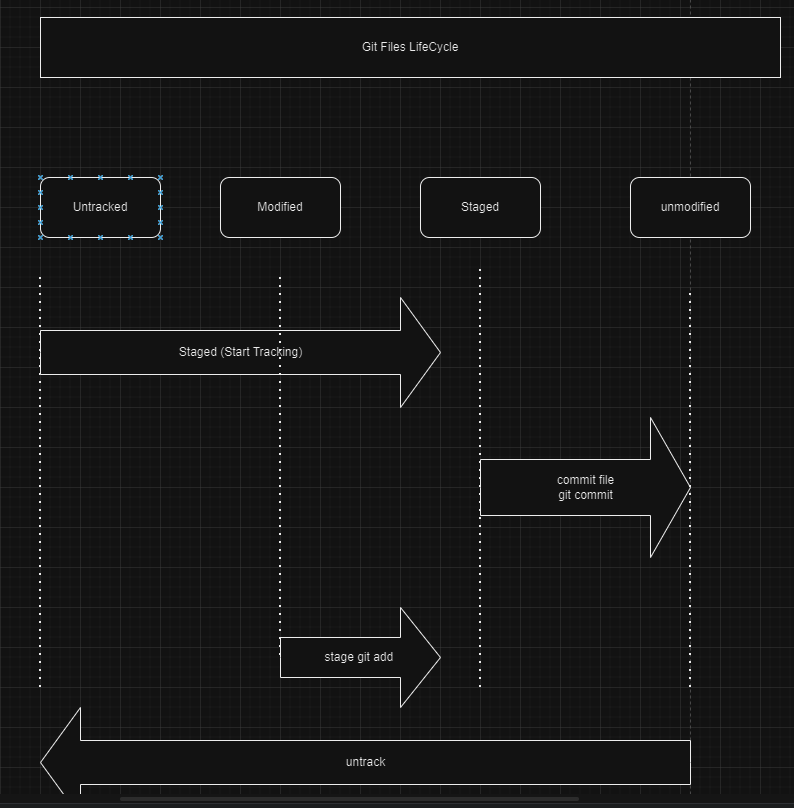
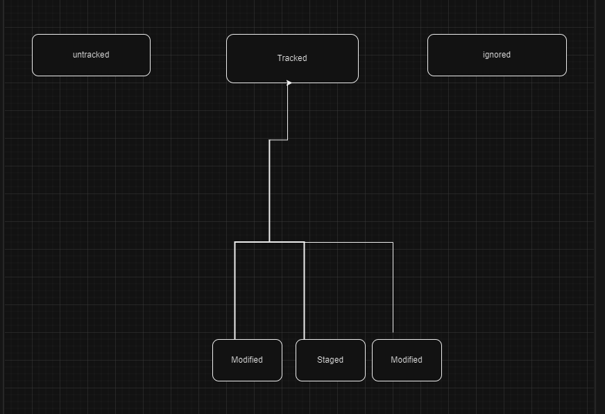

# <ins> Ignoring Files in Git </ins> #

- every files in git can be either `tracked or untracked`
- when we add a new file then `git` consider as `untracked file` and offer to `staged` and `commit` so that iut become the `tracked file from untracked file`
- if we don't want the file to be `tracked` then we can mark themn as `ignore` son that those will be ignored
- `ignored` is a `new file ststus` that we will introduce

**Need of Git Ignore by using .gitignore**

- here we are explicitly telling `git` which `files or folder` to be `ignored`
- hence the `changes` in `those files or folder` will be ignore by `git`
- rules for `ignoring files and folder` defined in the `.gitignore` file 
- `.gitignore` file must be commited 

- when the `files or folder` not added to the `.gitignore` file then that become the `untracked` by defaut and `git` will ask to add the same `onto the staging Area and ask to commit those changes` to make it `tracked`

- `.gitignore` can be placed in `anywhere` in the `directory` but it specifically placed in the `root` of the `diredctory`

- creation of the `.gitignore` file is one of the `first step` while the `project` intialization been happening

- we can also add `.gitignore` while `intializing the repository`

**Git File Lifecycle**

  - there are actually `4 stages` of the `git file life cycle` 

  - whenever the `file` then those will become `untracked files` if we want to `start tracking` then we need to use the command as `git add .` which will add those to the `staging area` and then only we can commit those changes 

  - when we commit those files then that becomes `unmodified` files 
  - when we `modify` the `unmodified files` then it become the `modified` files 
  - if we have a `modofed file` then we can add them to the `staging area` by using the `git add` command and then we can `commit them` from the `staging Area`
  - we can also change from the `file status` as `unmodified` to the `untacked` file as well

  - 

  - the status `modified/staged/unmmodified` are part of the `tracked statuses`

  - 
  
  - There are actually `3 statuses` in git and those are of 
    
    - untracked
    - tracked ( are further devided into unmodified, modified and staged)
    - ignored

  - Here these are the above `life cycle` of the `git command`

**Basic .gitignore rules**

  -  by default the `.gitignore` file also been `untracked` and can be tracked using the `git add` to add to the `staging Area` and `git commit` to put it to the `unmodified stage` which is part of `tracking phase`

  - when we are pushing the `code` to the `remote github repo` then if the file mnentioned in `.gitignore` file then those will not be pushed to remote repo

  - if we want to put all files present in the `folder` into the `.gitignore` then we have to mention the `foldername` as `<folder name>/` inside the `.gitignore`

  - we can add comment to the `.gitignore` file by putting the `#` symbol before same like `python`

  - we can igonre all the `file` of `particular pattern` by using the `wildcard` as `*`

  - when we put the `wildcard pattern` for the `files` no matter what `folder` if the `file pattern` matches then those will be ignored

  - we can see the `remote server` name of the `github repo` using the command as `git remote`

**commiting preveiously ignored files**

  - if we remove the `file name` from the `.gitignore` file then it will become `untracked` and we can able to stage and commit them to make it as `tracked`
  
  - if we want to make a `preveiously` commited files to be ignored  then we need to perform the below steps
    
    - add the `file` to the `.gitignore` file
    - delete the `file` from the current `working` directory so that it will not be tracked, but before that take the content
    - then we need to commit the changes
    - then we can create the file again as its already present in the `.gitignore` it will not be reflected

  - if want to `make the preveious commited files` to be ignored again there is an alternate way also available as well
    
    - add the files to the `.gitignore` file
    - we can use the command as `git rm --cached <filename that we want to keep in the working dir bit don't want to commit>` 
    - this command will help in removing the `tracked <file>` back to the `untracked place` so that those will not be commited while using the `git push` command
    - then again we need to commit the `.gitignore` file only not the `file that we added to the staging area from the unmodified location`
    - now when we use the `git push` only the `.gitignore` file will be commited not the rest

**Different gitignore template based on the Programming Language**

  - we can ignore the `build` folder like `bin`
  - we should ignore the `dependency` folder such as `node_modules`
  - we also should ignore the `compiled file` and `log file` such as `*.pyc` and `*.log`
  - hidden `OS` file such as `thumbs.db/.DS_Store` should also be ignored

  - by using the `gitignore.io` we can fetch the `template` of `.gitignore` for different programming language

  - we can also refer the `github.com/github/gitignore` to get the `template` for the `.gitignore` file

