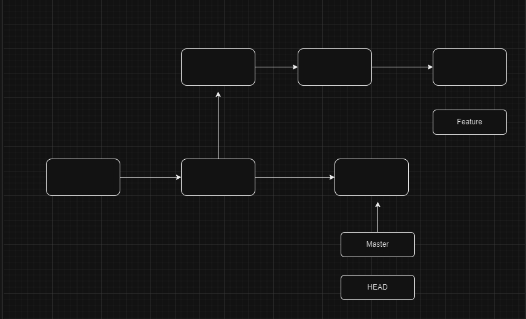
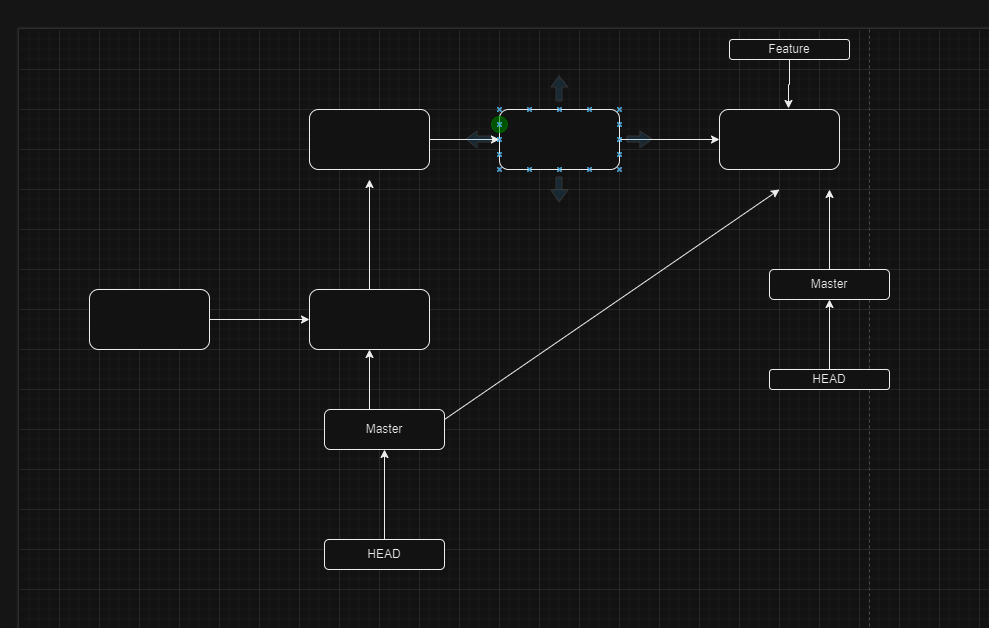
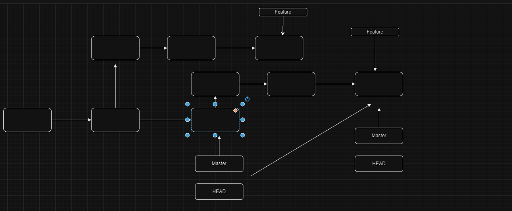

# <ins> Rebasing in Git </ins> #

- if we want to merge the `release or master` branch into the current `feature branch` in that case we can utilize the concept of `rebasing`
- rebasing should be applied on the `master or release` branch as it can be a `descructive` operation and it changes `history`

- rebasing actuially 2 step process
  
  - 1st is to rebase the `feature branch` ontop of the `master or release` branch
  - 2nd is to `Merging` the `feature` branch to `release or master ` branch , in this case `git` will create the `fast forward merge` and no extra commit will be performed

- rebasing create `brand new commits` in the `feature` branch and `commits` created in the `feature branches` will be removed after the `rebasing`

# <ins> Rebasing Branches </ins> #

- rebasing is the way to merge `2 branches` together

- **Advantages**

    - `rebasing` keep the `commit` history linear
    - `every` commit While the `rebase` should have only one parent unlike merging by `fast foward merge` ro `3 way merge`
    - while merging using the `fast foward merge` ro `3 way merge` there can be `multiple parent` for the `commits`
    
- **Drawback**
  
  - rebasing `rewrite` history i.e it does not keep all entire history of all commits
  - some commit can be lost during the rebasing , which can't be fetched until we don't have the `SHA` code for the same 

# <ins> Difference Between Merging and Rebasing </ins> #

#### Merging with 3 way Merge

  - if we want to merge the `Feature` branch to the `Master Branch` git will create a `3 way Merge` as there were additional commit on the `Master` after the Feature Branch been created
  
  - As we are doing `3 way Merge` then a new `merge commit` will going to be performed as a part of it 
  
  - all the `commit`  history of `master` and `feature` branch will be kept 

  - The New `Merge commit` have `2 parent` 
    
    - one `point` to the `Master branch Last commit`
    - other point to the `Feature branch Last commit` 

  - 

#### Merging with fast forward way Merge

  - if we wanto to merge the `Feature Branch` into the `master branch` where `master` branch has no additional commits then we can perform the `fats forward merge` where no additional commit will required

  - when we are using the `fast forward merge then` the the pic will be like below

  - Here in this case the `git` simply move the `pointer` of the `Master/HEAD` to the `feature` branch
  
  - 

#### Rebasing In Git

  - `Merging` preserve the `entire commit History`
  
  -  when we `rebase` branches then the `History` become `linear` in nature are we will not keep all the `commit history` of feature-branch
  
  - **`rebasing`** is a 2 step process
    
    - 1st is to rebase the `feature branch` ontop of the `master or release` branch
        
        - checkout to the `feature` branch by using the command as `git checkout feature`
        
        - rebase the `feature` branch on top of the `master` branch using the command as `git rebase master`
        
        - when we use the `git reabse master` then `git` create the `same number of duplicated commit` which is present in the `feature` branch on the `last commit of the master branch` 

        - preveious `commit` of the `feature` branch will be `nullifies` as there are no reference as `git` create `brand new duplicated commit` based on the `old commit` and associate them to the `last commit of master branch`

        - as the `parent` of the `commit` been changed from `somewhere in between of the master branch` to the `last commit of the master` hence the `commit` also changes and associated `SHA` code also changed

    - 2nd is to `Merging` the `feature` branch to `release or master ` branch , in this case `git` will create the `fast forward merge` and no extra commit will be performed
      
         - for this we need to checkout to the `master` branch using the `git checkout master`
      
         - then we need to perform merging the `rebased` feature branch to master branch using the command as `git merge feature`

        - as the `new duplicated commit` of the feature branch point to the `last commit of the master` hence `ff-merge` been performed and `no need of a New Merge commit`

        - in this case `history` of the commit become `linear` andf there will be no commit with `more than one parent`
        
        - old commit of the `feature` branch will be `garbage collected` 
        
        - once the `feature` branch been `merged` to `master` and `history become linear` then we can safely remove the `feature branch` as well

  - 

